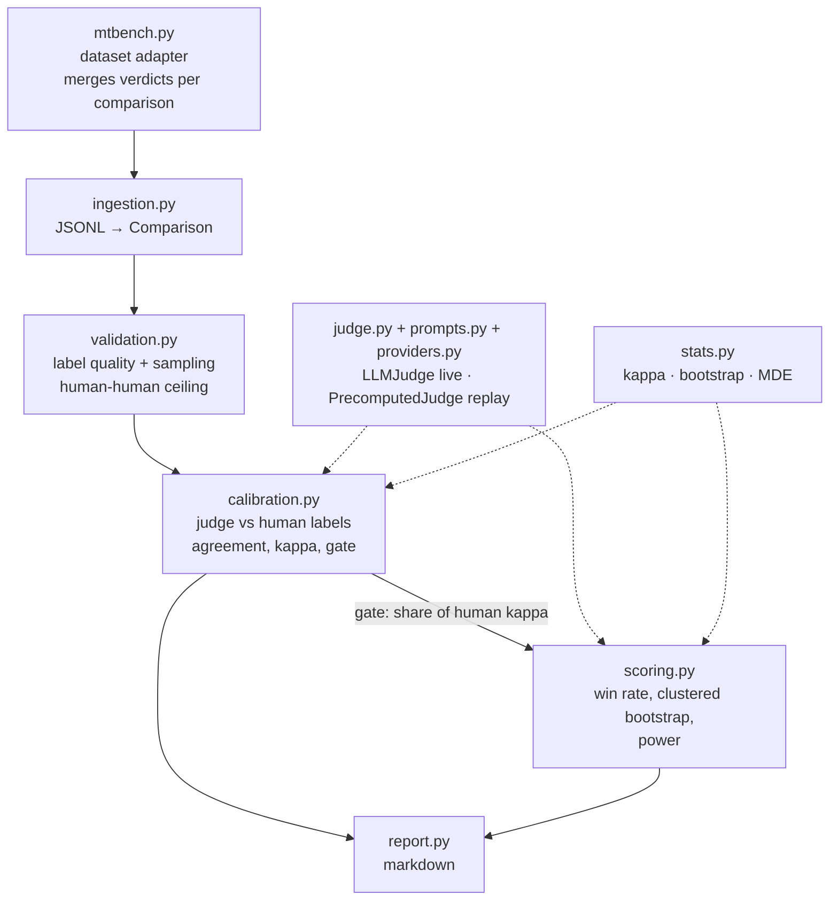

# Offline Evaluation & Judge Calibration Pipeline

Ingests pairwise human-preference data, measures how far an automated judge
can be trusted against those human labels, and uses it to compare two
candidate policies with an interval rather than a bare point estimate.

The design principle throughout: **no number is reported without the
evidence that it can be believed.** Judge agreement is stated against the
ceiling humans themselves reach on this data (not against an unreachable
100%), intervals account for the fact that two turns of one conversation
are not independent evidence, and a judge that fails calibration is refused
rather than quietly used anyway.

Every non-obvious decision behind this — why this statistical test, how the
judge was designed, what assumptions it rests on, and the real bugs found
while checking them — is in [`METHODOLOGY.md`](METHODOLOGY.md).

---

## Quickstart

```bash
python -m venv .venv && source .venv/bin/activate
pip install -e ".[dev]"

# ~1.4 MB fetched from the HuggingFace datasets-server API; the files
# written to data/ are larger (~24 MB) since every annotation/verdict row
# carries its own full copy of the prompt and both responses, undeduplicated.
# Idempotent — skips the fetch if the three files already exist.
python -m eval_pipeline.mtbench

# Free and deterministic: replays GPT-4's own published verdicts from
# MT-Bench instead of calling a live model.
python -m eval_pipeline.cli \
  --judge recorded \
  --preferences    data/mtbench_preferences.jsonl \
  --policy-outputs data/policy_outputs.jsonl \
  --verdicts       data/mtbench_gpt4_verdicts.jsonl \
  --policy-1-name  "gpt-3.5-turbo" \
  --policy-2-name  "vicuna-13b-v1.2" \
  --judge-name     "GPT-4 (MT-Bench recorded verdicts)" \
  --calibration-items 300

pytest   # 188 tests
```

The report lands in `output/evaluation_report.md`, checked into this repo so
it can be read without running anything. That run takes a few seconds, costs
nothing, and needs no API key — it replays a real GPT-4 judge's published
verdicts, so the numbers are reproducible rather than merely claimed. As of
this data pull: **gpt-3.5-turbo preferred, 74.0% of scored comparisons (95%
CI 65.5%–82.3%)**, judge calibrated at 98.3% of the human-human kappa
ceiling.

`output/evaluation_report_live.md` is the same report from a real, paid live
run against `claude-haiku-4-5` instead of GPT-4's recorded verdicts — the
second judge behind [`METHODOLOGY.md`](METHODOLOGY.md) §5.5's comparison
table, also checked in rather than only quoted.

### Judging with a live model

`--judge live` is the default, and the only option for data no recorded
judge has already seen. It calls Claude directly through the official
`anthropic` SDK — no multi-provider abstraction, since this project only
ever calls Claude.

```bash
pip install -e ".[live]"
export ANTHROPIC_API_KEY=sk-...

python -m eval_pipeline.cli \
  --preferences data/mtbench_preferences.jsonl \
  --policy-outputs data/policy_outputs.jsonl \
  --calibration-items 300
```

Before spending anything, it prints the call count, an estimated cost, and
refuses to proceed without an explicit `y` at a confirmation prompt (or
`--yes` for a non-interactive run — piped/scripted invocations are refused
outright rather than silently charged, since there is nobody there to
confirm). Every comparison is asked twice — once as given, once with the
two responses swapped — to defend against the judge just preferring
whichever response happens to be first; `--cache` (on by default,
`.judge_cache.jsonl`) means an interrupted or re-run pass never pays for an
identical call twice.

```
judge:      live via claude-opus-5
            892 calls (300 calibration + 146 held-out comparisons, each asked in both orderings)
            ~706 input tokens each, estimated cost $7.61
proceed? [y/N]
```

(Exact figures from this project's own data as of this write-up — a real
run always computes and prints its own numbers before asking, never these.)

Two more flags for a real live run: `--concurrency N` runs N judge calls in
flight at once (1, the default, is strictly sequential) — same total spend,
faster wall clock, since call count never depends on worker count. Pair it
with `--skip-parse-errors`: a comparison the judge never returns a parsable
`[[A]]`/`[[B]]`/`[[C]]` verdict for is counted and excluded instead of
aborting the run — off by default (a parse failure is loud on purpose), but
without it above `--concurrency 1`, an aborting parse failure no longer
stops the run after only the calls made so far, since every already-in-
flight call still completes (and is billed) before the exception surfaces.

---

## What a non-research stakeholder should read

Open `output/evaluation_report.md` and read exactly this much:

1. **Bottom line.** One paragraph. It is one of exactly three shapes:
   - *"X is preferred"* — act on it.
   - *"No reliable difference"* / *"Not enough data to tell"* — these are
     **not the same finding**. The first means the two policies are close;
     the second means the sample is too small to know either way. Only the
     second is fixed by collecting more held-out prompts.
   - *"No conclusion"* — the judge itself failed calibration. Nothing below
     this line should be acted on; the report explains why.

Everything below the bottom line is support for that one sentence, not a
second finding to act on separately:

2. **§1 How far the judge can be trusted** — its agreement with humans,
   measured against the *human-human* ceiling (humans routinely disagree
   with each other on preference data; expecting a judge to hit 100% is
   expecting it to out-agree humans themselves).
3. **§2 The comparison** — the win rate behind the bottom line, with its
   confidence interval and what got excluded and why.
4. **§3 What this does not account for** — caveats that survived being
   checked against this specific run's numbers, not boilerplate.

If §1 or §3 raise something you don't understand, that is the report
working as intended — it is meant to be legible enough that a claim can be
questioned, not just accepted. If the question is "why should I believe
*this* is the right statistical test" rather than "what does this run's
number mean," that's [`METHODOLOGY.md`](METHODOLOGY.md), not this report.

---

## Architecture

An interactive version of this diagram — pan/zoom, guided views for the
primary path / trust gate / external dependencies, light and dark themes —
is at [`docs/architecture.html`](docs/architecture.html) (open it directly
in a browser; built from `docs/architecture.spec.json` via
[Archify](https://github.com/tt-a1i/archify)).



`stats.py` depends on nothing and knows nothing about judges — it operates
on plain values and a caller-supplied cluster key, so the same
`bootstrap_ci` powers both calibration's agreement interval and scoring's
win-rate interval.

`schema.Comparison` is the one shape everything downstream shares: one row
per **comparison** (not per annotation), carrying every human label it
received. That is what lets a repeat-labelled item survive sampling intact
and lets a cluster bootstrap resample "this conversation" as a unit instead
of resampling individual, correlated annotations as if they were
independent.

### Module reference

| Module | Responsibility |
|---|---|
| `schema.py` | `Comparison`/`Annotation` — the shared data shape |
| `ingestion.py` | JSONL → `Comparison`, merging rows that describe the same item (by id, or by exact content match when there's no id) |
| `mtbench.py` | Fetches MT-Bench's human judgments + GPT-4 verdicts; the free, reproducible data source everything else runs on. Also where reversed-slot-order rows get normalised (`_canonical_row`) *before* `ingestion.py` ever sees them — `ingestion.py`'s own content-match fallback is an exact match, not order-tolerant — and where each row's turn number picks the right (question, answer) pair out of MT-Bench's full-transcript conversation field, carrying everything before it as prior-turn context |
| `validation.py` | Flags noisy/contradictory labels explicitly; the human-human agreement ceiling |
| `prompts.py` | The judge's system + user prompt, based on MT-Bench's own published pair-wise prompts — single-turn and multi-turn variants of both, picked by whether the comparison carries prior-turn context |
| `judge.py` | `Judge` interface, the position-swap defense, `LLMJudge` (live) and `PrecomputedJudge` (replay) |
| `providers.py` | The live backend: a real Claude call via the `anthropic` SDK, a response cache, a cost estimate |
| `calibration.py` | Judge-vs-human agreement and kappa, measured the same way the human ceiling is; the trust gate |
| `stats.py` | Cohen's kappa, cluster bootstrap CI, minimum detectable effect |
| `scoring.py` | Win rate between two policies, with a clustered CI and a power check |
| `report.py` | Renders the markdown report |
| `cli.py` | Wires all of the above into one runnable command |
| `reward_hacking.py` | Tests whether the judge can be gamed by content-free padding; a length-normalization mitigation. See [`REWARD_HACKING.md`](REWARD_HACKING.md) |
| `service.py` | The pipeline as an HTTP service — recorded-judge by default, live-judge behind an operator key and a two-step cost-confirmation flow. See [`DEPLOYMENT.md`](DEPLOYMENT.md) |

---

## Testing

```bash
pytest              # everything, 188 tests
pytest tests/test_calibration.py -q   # one module
```

Every module has its own test file exercising its logic directly (kappa on
hand-computed examples with known exact values, the cluster bootstrap
demonstrably widening when evidence is more correlated, the gate passing
and failing on constructed calibration reports). `tests/test_cli.py` is
the shallow end-to-end layer: it asserts the pipeline *runs* and produces a
report — including a deliberately bad judge that fails the gate but still
gets a report written, with its own "no conclusion" bottom line rather
than a crash — while the per-module tests are what assert *correctness* of
the scoring and statistical logic.

None of the tests call a live model or touch the network; `mtbench.py`'s
own fetch logic is tested against small synthetic rows shaped like the real
API response, not against HuggingFace. The one exception in the whole
project is `python -m eval_pipeline.reward_hacking`, run manually rather
than as part of the suite — see [`REWARD_HACKING.md`](REWARD_HACKING.md).

---

## Deployment

The pipeline is also callable as an HTTP service — recorded-judge mode by
default, live-judge mode gated behind an operator-set key — via
`uvicorn eval_pipeline.service:app` or `docker build . && docker run
-p 8080:8080 ...`, deployable on DigitalOcean App Platform via
`.do/app.yaml`. See [`DEPLOYMENT.md`](DEPLOYMENT.md) for the API, how live
mode stays safe on a publicly reachable endpoint, and exactly what was and
wasn't verified locally (not actually deployed as part of this submission).

---

## Data

[`lmsys/mt_bench_human_judgments`](https://huggingface.co/datasets/lmsys/mt_bench_human_judgments)
(CC-BY-4.0) — 3355 human judgments (mostly 3 judges per item) and 2400
GPT-4 judgments, fetched via the HuggingFace datasets-server REST API.
`gpt-3.5-turbo` vs `vicuna-13b-v1.2` is held out entirely from calibration
and used only as the two compared policies — the judge never sees its human
labels.

Fetched data lands in `data/*.jsonl`, gitignored on purpose: the fetch
command is the artefact worth keeping, not the bytes, and re-running
`python -m eval_pipeline.mtbench` reproduces them exactly.

## Assumptions and known limits

- **The human majority is assumed to be a reasonable ground truth**, and it
  is not fully defensible: a real share of items are ones humans themselves
  disagreed on (see §1 of the report, "contested items"). This pipeline
  reports that rate rather than hiding it, but does not resolve it.
- **This build does not include a bias-correction stage** (e.g. inverting
  the judge's measured error rates via Rogan–Gladen) or a held-out
  leave-one-pair-out validation harness for one. The judge's own verdicts,
  calibrated and gated against the human ceiling, are reported directly.
- **Reward hacking**: tested directly, not assumed away — see
  [`REWARD_HACKING.md`](REWARD_HACKING.md). A content-free padding attack
  had no measurable effect on `claude-haiku-4-5` in a 25-item live run, but
  the same experiment surfaced a real, unresolved caveat on this project's
  own headline number: equalizing response length dropped `gpt-3.5-turbo`'s
  measured win rate from 87.5% to 64.7% on that subsample, suggesting its
  advantage may be partly verbosity rather than purely quality.
